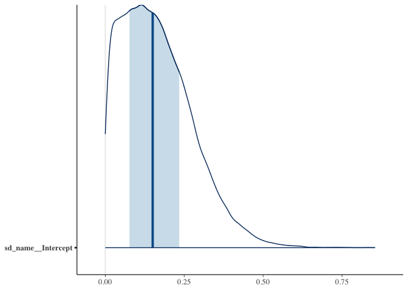
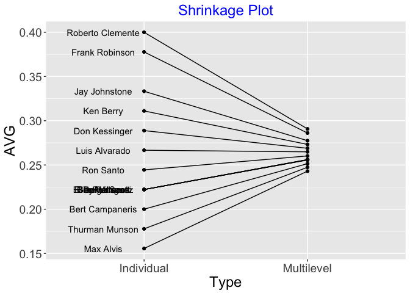

Load some packages:

    library(pscl)
    library(brms)
    library(tidyverse)
    library(BApredict)
    library(TeachBayes)
    library(runjags)
    library(bayesplot)
    library(coda)

#### Getting the baseball data

Read in the Efron and Morris dataset:

    select(EfronMorris, name, r) %>%
      mutate(n = 45) -> d
    d

    ##                name  r  n
    ## 1  Roberto Clemente 18 45
    ## 2    Frank Robinson 17 45
    ## 3      Frank Howard 16 45
    ## 4     Jay Johnstone 15 45
    ## 5         Ken Berry 14 45
    ## 6       Jim Spencer 14 45
    ## 7     Don Kessinger 13 45
    ## 8     Luis Alvarado 12 45
    ## 9         Ron Santo 11 45
    ## 10      Ron Swoboda 11 45
    ## 11        Del Unser 10 45
    ## 12   Billy Williams 10 45
    ## 13     George Scott 10 45
    ## 14  Rico Petrocelli 10 45
    ## 15  Ellie Rodriguez 10 45
    ## 16  Bert Campaneris  9 45
    ## 17   Thurman Munson  8 45
    ## 18        Max Alvis  7 45

#### The Model

The exchangeable model:

*y**j* ∼ *B**i**n*(*n**j*, *p**j*), *j* = 1, ..., 18
*θ**j* = *l**o**g**i**t*(*p**j*) ∼ *N*(*μ*, *σ*), *j* = 1, ..., 18
*μ* ∼ *N*(0, 2), *σ* ∼ *C**a**u**c**h**y*(0, 1)

#### Fitting using Stan

    fit <- brm(data = d, family = binomial,
               r | trials(n) ~ 1 + (1 | name),
               prior = c(prior(normal(0, 2), class = Intercept),
                         prior(cauchy(0, 1), class = sd)),
               iter = 20000)

    ## 
    ## SAMPLING FOR MODEL '10da0ab97b97aa1f6a1a6d8c98465f60' NOW (CHAIN 1).
    ## Chain 1: 
    ## Chain 1: Gradient evaluation took 3e-05 seconds
    ## Chain 1: 1000 transitions using 10 leapfrog steps per transition would take 0.3 seconds.
    ## Chain 1: Adjust your expectations accordingly!
    ## Chain 1: 
    ## Chain 1: 
    ## Chain 1: Iteration:     1 / 20000 [  0%]  (Warmup)
    ## Chain 1: Iteration:  2000 / 20000 [ 10%]  (Warmup)
    ## Chain 1: Iteration:  4000 / 20000 [ 20%]  (Warmup)
    ## Chain 1: Iteration:  6000 / 20000 [ 30%]  (Warmup)
    ## Chain 1: Iteration:  8000 / 20000 [ 40%]  (Warmup)
    ## Chain 1: Iteration: 10000 / 20000 [ 50%]  (Warmup)
    ## Chain 1: Iteration: 10001 / 20000 [ 50%]  (Sampling)
    ## Chain 1: Iteration: 12000 / 20000 [ 60%]  (Sampling)
    ## Chain 1: Iteration: 14000 / 20000 [ 70%]  (Sampling)
    ## Chain 1: Iteration: 16000 / 20000 [ 80%]  (Sampling)
    ## Chain 1: Iteration: 18000 / 20000 [ 90%]  (Sampling)
    ## Chain 1: Iteration: 20000 / 20000 [100%]  (Sampling)
    ## Chain 1: 
    ## Chain 1:  Elapsed Time: 1.91323 seconds (Warm-up)
    ## Chain 1:                1.90323 seconds (Sampling)
    ## Chain 1:                3.81646 seconds (Total)
    ## Chain 1: 
    ## 
    ## SAMPLING FOR MODEL '10da0ab97b97aa1f6a1a6d8c98465f60' NOW (CHAIN 2).
    ## Chain 2: 
    ## Chain 2: Gradient evaluation took 2.5e-05 seconds
    ## Chain 2: 1000 transitions using 10 leapfrog steps per transition would take 0.25 seconds.
    ## Chain 2: Adjust your expectations accordingly!
    ## Chain 2: 
    ## Chain 2: 
    ## Chain 2: Iteration:     1 / 20000 [  0%]  (Warmup)
    ## Chain 2: Iteration:  2000 / 20000 [ 10%]  (Warmup)
    ## Chain 2: Iteration:  4000 / 20000 [ 20%]  (Warmup)
    ## Chain 2: Iteration:  6000 / 20000 [ 30%]  (Warmup)
    ## Chain 2: Iteration:  8000 / 20000 [ 40%]  (Warmup)
    ## Chain 2: Iteration: 10000 / 20000 [ 50%]  (Warmup)
    ## Chain 2: Iteration: 10001 / 20000 [ 50%]  (Sampling)
    ## Chain 2: Iteration: 12000 / 20000 [ 60%]  (Sampling)
    ## Chain 2: Iteration: 14000 / 20000 [ 70%]  (Sampling)
    ## Chain 2: Iteration: 16000 / 20000 [ 80%]  (Sampling)
    ## Chain 2: Iteration: 18000 / 20000 [ 90%]  (Sampling)
    ## Chain 2: Iteration: 20000 / 20000 [100%]  (Sampling)
    ## Chain 2: 
    ## Chain 2:  Elapsed Time: 1.87347 seconds (Warm-up)
    ## Chain 2:                1.91953 seconds (Sampling)
    ## Chain 2:                3.793 seconds (Total)
    ## Chain 2: 
    ## 
    ## SAMPLING FOR MODEL '10da0ab97b97aa1f6a1a6d8c98465f60' NOW (CHAIN 3).
    ## Chain 3: 
    ## Chain 3: Gradient evaluation took 1.6e-05 seconds
    ## Chain 3: 1000 transitions using 10 leapfrog steps per transition would take 0.16 seconds.
    ## Chain 3: Adjust your expectations accordingly!
    ## Chain 3: 
    ## Chain 3: 
    ## Chain 3: Iteration:     1 / 20000 [  0%]  (Warmup)
    ## Chain 3: Iteration:  2000 / 20000 [ 10%]  (Warmup)
    ## Chain 3: Iteration:  4000 / 20000 [ 20%]  (Warmup)
    ## Chain 3: Iteration:  6000 / 20000 [ 30%]  (Warmup)
    ## Chain 3: Iteration:  8000 / 20000 [ 40%]  (Warmup)
    ## Chain 3: Iteration: 10000 / 20000 [ 50%]  (Warmup)
    ## Chain 3: Iteration: 10001 / 20000 [ 50%]  (Sampling)
    ## Chain 3: Iteration: 12000 / 20000 [ 60%]  (Sampling)
    ## Chain 3: Iteration: 14000 / 20000 [ 70%]  (Sampling)
    ## Chain 3: Iteration: 16000 / 20000 [ 80%]  (Sampling)
    ## Chain 3: Iteration: 18000 / 20000 [ 90%]  (Sampling)
    ## Chain 3: Iteration: 20000 / 20000 [100%]  (Sampling)
    ## Chain 3: 
    ## Chain 3:  Elapsed Time: 1.78144 seconds (Warm-up)
    ## Chain 3:                1.91329 seconds (Sampling)
    ## Chain 3:                3.69473 seconds (Total)
    ## Chain 3: 
    ## 
    ## SAMPLING FOR MODEL '10da0ab97b97aa1f6a1a6d8c98465f60' NOW (CHAIN 4).
    ## Chain 4: 
    ## Chain 4: Gradient evaluation took 1.6e-05 seconds
    ## Chain 4: 1000 transitions using 10 leapfrog steps per transition would take 0.16 seconds.
    ## Chain 4: Adjust your expectations accordingly!
    ## Chain 4: 
    ## Chain 4: 
    ## Chain 4: Iteration:     1 / 20000 [  0%]  (Warmup)
    ## Chain 4: Iteration:  2000 / 20000 [ 10%]  (Warmup)
    ## Chain 4: Iteration:  4000 / 20000 [ 20%]  (Warmup)
    ## Chain 4: Iteration:  6000 / 20000 [ 30%]  (Warmup)
    ## Chain 4: Iteration:  8000 / 20000 [ 40%]  (Warmup)
    ## Chain 4: Iteration: 10000 / 20000 [ 50%]  (Warmup)
    ## Chain 4: Iteration: 10001 / 20000 [ 50%]  (Sampling)
    ## Chain 4: Iteration: 12000 / 20000 [ 60%]  (Sampling)
    ## Chain 4: Iteration: 14000 / 20000 [ 70%]  (Sampling)
    ## Chain 4: Iteration: 16000 / 20000 [ 80%]  (Sampling)
    ## Chain 4: Iteration: 18000 / 20000 [ 90%]  (Sampling)
    ## Chain 4: Iteration: 20000 / 20000 [100%]  (Sampling)
    ## Chain 4: 
    ## Chain 4:  Elapsed Time: 1.72729 seconds (Warm-up)
    ## Chain 4:                1.89989 seconds (Sampling)
    ## Chain 4:                3.62719 seconds (Total)
    ## Chain 4:

#### Summarize posterior – compute E(*σ*|*y*)

    post <- posterior_samples(fit)
    mean(post[, "sd_name__Intercept"])

    ## [1] 0.1645716

    mcmc_areas(post, pars = "sd_name__Intercept")

    (estimates <- plogis(coef(fit)$name[, 1, 1]))

    ##  Bert Campaneris   Billy Williams        Del Unser    Don Kessinger 
    ##        0.2506012        0.2554627        0.2553876        0.2692035 
    ##  Ellie Rodriguez     Frank Howard   Frank Robinson     George Scott 
    ##        0.2555017        0.2831221        0.2875939        0.2554860 
    ##    Jay Johnstone      Jim Spencer        Ken Berry    Luis Alvarado 
    ##        0.2783717        0.2734259        0.2736002        0.2644104 
    ##        Max Alvis  Rico Petrocelli Roberto Clemente        Ron Santo 
    ##        0.2418950        0.2554514        0.2919862        0.2601071 
    ##      Ron Swoboda   Thurman Munson 
    ##        0.2600062        0.2465093

#### Fit the same model in JAGS

    modelString <-"
    model {
    ## sampling
    for (i in 1:N){
    y[i] ~ dbin(p[i], n[i])
    logit(p[i]) <- theta[i]
    theta[i] ~ dnorm(mu, tau)
    }
    ## priors
    mu ~ dnorm(0, 0.25)
    tau <- 1 / (sigma * sigma)
    sigma ~ dt(0, 1, 1) T(0, )
    }
    "

    the_data <- list(y = d$r, n = d$n, N = 18)
    posterior <- run.jags(modelString,
                          n.chains = 1,
                          data = the_data,
                          monitor = c("theta", "mu", "sigma"),
                          adapt = 1000,
                          burnin = 10000,
                          sample = 50000)

    ## Compiling rjags model...
    ## Calling the simulation using the rjags method...
    ## Adapting the model for 1000 iterations...
    ## Burning in the model for 10000 iterations...
    ## Running the model for 50000 iterations...
    ## Simulation complete
    ## Calculating summary statistics...
    ## Finished running the simulation

#### Compute E(*σ*|*y*)

    posterior %>% as.mcmc() %>% as.data.frame() -> post2
    mean(post2[, "sigma"])

    ## [1] 0.1564863

    plogis(apply(post2, 2, mean)[1:18]) -> estimates

#### Shrinkage plot

    S <- data.frame(Player = d$name,
                    Individual = d$r / d$n,
                    Multilevel = estimates)
    shrinkage_plot(S) +
      increasefont()

